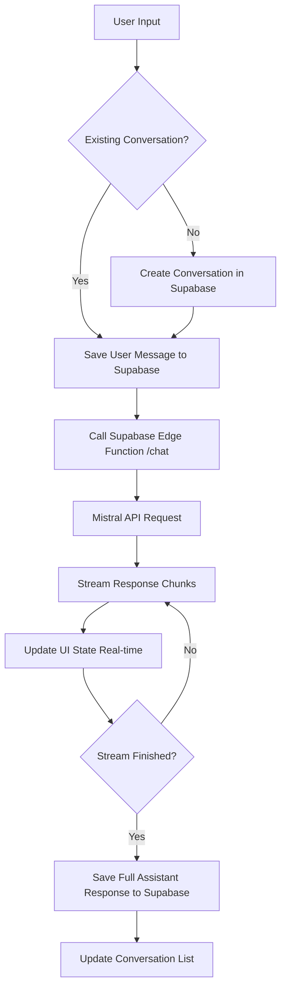

# Rin AI Architecture & Workflow

This document outlines the technical architecture and AI workflow of the Rin AI assistant.

## AI Workflow Diagram

## Technical Stack

### 1. Frontend (React + Vite)
- **State Management**: React Hooks (`useChat`, `useConversations`) for managing message streams and UI state.
- **UI Components**: shadcn/ui and Tailwind CSS for a premium, responsive design.
- **Icons**: Lucide React.

### 2. Backend (Supabase Edge Functions)
- **Runtime**: Deno.
- **Function**: `supabase/functions/chat/index.ts`.
- **Logic**: Orchestrates requests to the Mistral API, manages streaming headers, and handles error reporting.

### 3. AI Engine (Mistral AI)
- **Model**: `mistral-large-latest`.
- **System Prompt**: Defines Rin AI as a helpful, harmless, and honest assistant.

### 4. Database (Supabase / PostgreSQL)
- **Tables**:
    - `profiles`: User profile data and metadata.
    - `conversations`: Stores chat sessions with titles and timestamps.
    - `messages`: Stores individual user and assistant messages.
    - `user_roles`: Manages 'admin' vs 'user' access levels.
- **Security**: Row Level Security (RLS) ensures data isolation between users.

## Security & Access Control

Rin AI uses a tiered access system:
- **User Role**: Can only view and interact with their own conversations.
- **Admin Role**: Access to the Admin Panel (`/admin`) to monitor system-wide activity and user engagement.

## Environment Variables Required

| Variable | Description |
| :--- | :--- |
| `VITE_SUPABASE_URL` | Your Supabase project URL |
| `VITE_SUPABASE_ANON_KEY` | Public anonymous key for client-side Supabase calls |
| `MISTRAL_API_KEY` | Set in Supabase Dashboard (Edge Function environment) |
