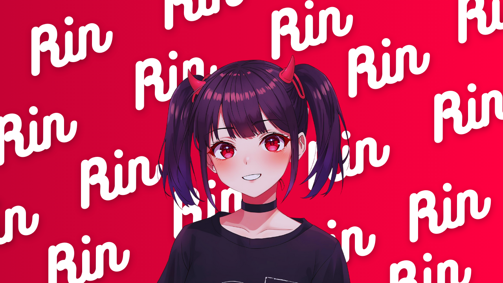

# Rin AI

A Mistral model powered chatbot built with React, Vite, and Supabase.

## Features

- **Mistral Large**: Powered by Mistral's advanced language models.
- **Persistent Chat**: Securely store and retrieve your conversation history.
- **Real-time Streaming**: Instant responses with a smooth user interface.
- **Secure**: Authentication and data isolation via Supabase.

## Getting Started

1. **Clone the repo**
2. **Install dependencies**: `npm install`
3. **Configure environment**: Copy `.env.example` to `.env` and add your keys.
4. **Deploy Edge Functions**: `npx supabase functions deploy chat`
5. **Run locally**: `npm run dev`

## Tech Stack

- **Frontend**: React, Vite, Tailwind CSS
- **Backend**: Supabase Edge Functions
- **AI**: Mistral AI API

---

Built by [Sowmiyan-S](https://github.com/sowmiyan-s)
